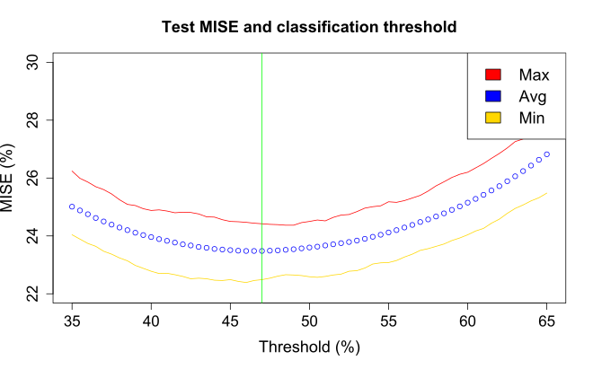

# A statistical learning model to predict heart disease predisposition through physiological parameters and habits #

- [x] *Trend of the misclassification error (MISE) as function of the classification threshold, logistic regression.*

## Authors ##
+ **Lorenzo LEONI**, postgraduate in Computer Engineering at University of Bergamo.
+ **Andrea TRESOLDI**, postgraduate in Computer Engineering at University of Bergamo.

## Abstract ##
According to the Center for Disease Control and Prevention (CDC), heart disease is one of the leading causes of death for people in the U.S. The aim of this study is to predict heart disease predisposition through physiological parameters and habits (e.g. BMI, diabetes, sleep time and smoking) by using statistical learning methods.

## Ketwords ##
Heart disease, statistical learning methods, logistic regression, undersampling.
